# P.I.L.L.A.R.


**P.I.L.L.A.R.** (Privacy risk Identification with LINDDUN and LLM Analysis
Report) is a tool which helps developers to identify privacy threats in their
software. It uses the [LINDDUN](https://linddun.org/) methodology executed by
Large Language Models (LLMs) to identify privacy threats given the description
of the application to analyze or its Data Flow Diagram (DFD). Once privacy
threats have been elicited, P.I.L.L.A.R. offers the possibility to assess their
impact and suggest control measures, based on the [privacy
patterns](https://privacypatterns.org/) website. Finally, users can download a
report of their privacy threat modeling. 

The tool is designed to be used by developers and security analysts to easily
evaluate the privacy risks of their software and take the necessary actions to
mitigate them, offering a good starting point for privacy analysis.


## Installation

To install the project, you need to clone the repository and install the
dependencies. You can do this by running the following commands:

```bash 
git clone https://github.com/AndreaBissoli/pillar.git 
cd pillar 
pip install -r requirements.txt 
streamlit run main.py 
```

## Usage

To use the tool, follow the instructions on the web interface. You will need
API keys of some LLM providers to use the tool, especially an OpenAI API key,
as some features only work with it (for now). You can find more information on
how to get an API key in the [OpenAI
website](https://platform.openai.com/account/api-keys). Other supported LLM
providers are [MistralAI](https://console.mistral.ai/api-keys) and [Google
Gemini](https://makersuite.google.com/app/apikey). If you would like to see
more LLM providers supported, feel free to open an issue or a pull request.

## Tool Architecture



This is the tool architecture, highlighting the different components of the tool
and the expected usage flow.


## Features

- **Application Description**: Provide a natural language description of your
application, specifying the type (e.g., mobile app, web app), the data it
collects, and the data policy.
- **Data Flow Diagram (DFD) Management**: Upload, edit, generate from an image
or description, and download a Data Flow Diagram (DFD) of the application to
identify privacy threats.
- **LINDDUN Analysis**: Perform a simple LINDDUN analysis of the application in
the Threat Model tab.
- **LINDDUN Go Simulation**: Conduct a [LINDDUN
Go](https://linddun.org/linddun-go/) simulation for the application in the
LINDDUN Go tab, utilizing one or multiple LLM agents.
- **LINDDUN Pro Methodology**: Use the [LINDDUN
Pro](https://linddun.org/linddun-pro/) methodology with the provided DFD to
identify precise privacy threats in the LINDDUN Pro tab.
- **Impact Assessment and Control Measures**: Assess the impact of identified
privacy threats and suggest control measures based on the [privacy
patterns](https://privacypatterns.org/) website.
- **Report Generation**: Download a comprehensive report of the privacy threat
modeling of the application.

## License

This project is licensed under the Apache License, Version 2.0 - see the [LICENSE](LICENSE.txt)
file for details.

## Contacts

This project is developed by [Andrea
Bissoli](https://www.linkedin.com/in/andrea-bissoli/) and [Majid
Mollaeefar](https://www.linkedin.com/in/majid-mollaeefar/) as an internship
project for [Fondazione Bruno Kessler](https://www.fbk.eu/). For any questions
or feedback, feel free to contact us.
